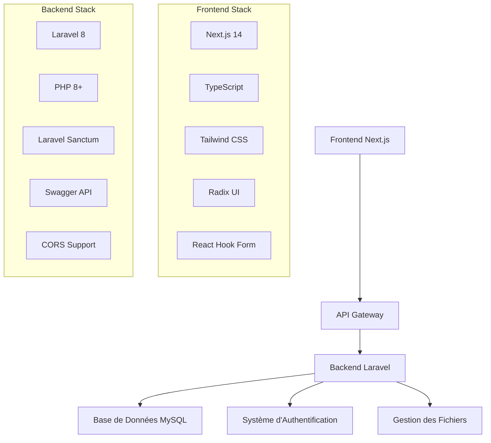

# 🏥 KamerCare - Plateforme Médicale Camerounaise

<div align="center">
  
  
  <p><strong>Une plateforme moderne de gestion médicale pour le Cameroun</strong></p>
  
  [](https://nextjs.org/)
  [](https://laravel.com/)
  [](https://www.typescriptlang.org/)
  [](https://www.php.net/)
  [](https://tailwindcss.com/)
</div>

---

## 📋 Table des Matières

- [🎯 À Propos](#-à-propos)
- [✨ Fonctionnalités](#-fonctionnalités)
- [🏗️ Architecture](#️-architecture)
- [🚀 Frontend - Next.js](#-frontend---nextjs)
- [⚙️ Backend - Laravel](#️-backend---laravel)
- [📦 Installation](#-installation)
- [🔧 Configuration](#-configuration)
- [🚀 Démarrage](#-démarrage)
- [📱 Utilisation](#-utilisation)
- [🤝 Contribution](#-contribution)
- [📄 Licence](#-licence)

---

## 🎯 À Propos

**KamerCare** est une plateforme médicale moderne conçue spécifiquement pour le système de santé camerounais. Elle facilite la connexion entre patients et professionnels de santé à travers tout le territoire national, en offrant une interface intuitive et des fonctionnalités adaptées aux besoins locaux.

### 🌟 Vision
Démocratiser l'accès aux soins de santé au Cameroun en connectant patients et médecins via une plateforme numérique moderne et accessible.

### 🎯 Mission
- Faciliter la prise de rendez-vous médicaux
- Améliorer la gestion des dossiers patients
- Optimiser la communication entre professionnels de santé
- Offrir un accès équitable aux soins dans toutes les régions

---

## ✨ Fonctionnalités

### 👥 Pour les Patients
- 🔍 **Recherche avancée** de médecins par région, ville et spécialité
- 📅 **Prise de rendez-vous** en ligne simplifiée
- 📱 **Interface responsive** adaptée mobile et desktop
- 🌍 **Support multilingue** (Français/Anglais)
- 📋 **Gestion du profil** et historique médical
- 🔔 **Notifications** de rappel de rendez-vous

### 👨‍⚕️ Pour les Médecins
- 📊 **Tableau de bord** professionnel complet
- 📅 **Gestion d'agenda** et disponibilités
- 👥 **Gestion des patients** et dossiers médicaux
- 📈 **Statistiques** et rapports d'activité
- 💬 **Communication** sécurisée avec les patients
- 🏥 **Gestion multi-établissements**

### 🏥 Pour les Administrateurs
- 👨‍💼 **Gestion des utilisateurs** (patients, médecins, staff)
- 🏥 **Gestion des établissements** de santé
- 📊 **Analytics** et tableaux de bord
- ⚙️ **Configuration système** avancée
- 🔐 **Gestion des permissions** et rôles

---

## 🏗️ Architecture



---

## 🚀 Frontend - Next.js

### 🛠️ Technologies Utilisées

| Technologie | Version | Description |
|-------------|---------|-------------|
| **Next.js** | 14.x | Framework React avec SSR/SSG |
| **TypeScript** | 5.x | Typage statique pour JavaScript |
| **Tailwind CSS** | 3.x | Framework CSS utilitaire |
| **Radix UI** | Latest | Composants UI accessibles |
| **React Hook Form** | 7.x | Gestion des formulaires |
| **Lucide React** | Latest | Icônes modernes |
| **Leaflet** | 1.9.x | Cartes interactives |

### 📁 Structure du Projet Frontend

```
frontend_nextjs/
├── app/                    # App Router (Next.js 13+)
│   ├── admin/             # Interface administrateur
│   ├── dashboard/         # Tableau de bord utilisateur
│   ├── doctor/           # Interface médecin
│   ├── doctor-portal/    # Portail médecin avancé
│   ├── login/            # Page de connexion
│   ├── signup/           # Page d'inscription
│   └── page.tsx          # Page d'accueil
├── components/            # Composants réutilisables
│   ├── auth/             # Composants d'authentification
│   ├── landing-page-sections/ # Sections page d'accueil
│   ├── ui/               # Composants UI de base
│   └── navbar.tsx        # Navigation principale
├── hooks/                # Hooks React personnalisés
│   ├── use-auth.ts       # Gestion authentification
│   ├── use-cities.ts     # Gestion des villes
│   └── use-mobile.ts     # Détection mobile
├── lib/                  # Utilitaires et configuration
│   ├── api.ts           # Client API
│   └── utils.ts         # Fonctions utilitaires
└── public/              # Assets statiques
    ├── KamerCare-logo.png
    └── images/
```

### 🎨 Fonctionnalités Frontend

- **🎨 Design System** : Interface moderne avec Tailwind CSS et Radix UI
- **📱 Responsive Design** : Optimisé pour tous les appareils
- **🌙 Mode Sombre** : Support du thème sombre/clair
- **🌍 Internationalisation** : Support Français/Anglais
- **🔍 Recherche Avancée** : Filtrage par région, ville, spécialité
- **📍 Géolocalisation** : Intégration de cartes avec Leaflet
- **⚡ Performance** : Optimisations Next.js (SSR, SSG, Image Optimization)

---

## ⚙️ Backend - Laravel

### 🛠️ Technologies Utilisées

| Technologie | Version | Description |
|-------------|---------|-------------|
| **Laravel** | 8.x | Framework PHP moderne |
| **PHP** | 8.0+ | Langage de programmation |
| **Laravel Sanctum** | 2.x | Authentification API |
| **L5-Swagger** | 8.x | Documentation API automatique |
| **CORS** | 2.x | Support Cross-Origin |
| **MySQL** | 8.0+ | Base de données relationnelle |

### 📁 Structure du Projet Backend

```
backend_laravel/
├── app/
│   ├── Http/
│   │   └── Controllers/
│   │       └── Api/
│   │           ├── AuthController.php      # Authentification
│   │           ├── PatientController.php   # Gestion patients
│   │           ├── DoctorController.php    # Gestion médecins
│   │           ├── AppointmentController.php # Rendez-vous
│   │           └── MedicalRecordController.php # Dossiers médicaux
│   ├── Models/              # Modèles Eloquent
│   └── Policies/           # Politiques d'autorisation
├── database/
│   ├── migrations/         # Migrations de base de données
│   └── seeders/           # Données de test
├── routes/
│   ├── api.php            # Routes API
│   └── web.php            # Routes web
├── config/                # Configuration Laravel
└── storage/              # Stockage fichiers
```

### 🔌 API Endpoints

#### 🔐 Authentification
```http
POST   /api/register          # Inscription
POST   /api/login             # Connexion
POST   /api/logout            # Déconnexion
GET    /api/me                # Profil utilisateur
```

#### 👥 Gestion des Patients
```http
GET    /api/patients          # Liste des patients
POST   /api/patients          # Créer un patient
GET    /api/patients/{id}     # Détails patient
PUT    /api/patients/{id}     # Modifier patient
DELETE /api/patients/{id}     # Supprimer patient
```

#### 👨‍⚕️ Gestion des Médecins
```http
GET    /api/doctors           # Liste des médecins
POST   /api/doctors           # Créer un médecin
GET    /api/doctors/{id}      # Détails médecin
PUT    /api/doctors/{id}      # Modifier médecin
PATCH  /api/doctors/{id}/toggle-availability # Disponibilité
```

#### 📅 Gestion des Rendez-vous
```http
GET    /api/appointments      # Liste des RDV
POST   /api/appointments      # Créer un RDV
GET    /api/appointments/{id} # Détails RDV
PUT    /api/appointments/{id} # Modifier RDV
```

---

## 📦 Installation

### 📋 Prérequis

- **Node.js** 18+ et npm/yarn
- **PHP** 8.0+ avec extensions requises
- **Composer** pour la gestion des dépendances PHP
- **MySQL** 8.0+ ou MariaDB
- **Git** pour le contrôle de version

### 🔽 Clonage du Projet

```bash
git clone https://github.com/votre-username/cameroon-medical-platform.git
cd cameroon-medical-platform
```

### 🎯 Installation Frontend

```bash
cd frontend_nextjs

# Installation des dépendances
npm install
# ou
yarn install

# Configuration de l'environnement
cp .env.example .env.local
```

### ⚙️ Installation Backend

```bash
cd backend_laravel

# Installation des dépendances
composer install

# Configuration de l'environnement
cp .env.example .env

# Génération de la clé d'application
php artisan key:generate

# Configuration de la base de données
php artisan migrate

# Données de test (optionnel)
php artisan db:seed
```

---

## 🔧 Configuration

### 🌐 Variables d'Environnement Frontend

```env
# .env.local
NEXT_PUBLIC_API_URL=http://localhost:8000/api
NEXT_PUBLIC_APP_NAME=KamerCare
NEXT_PUBLIC_DEFAULT_LANGUAGE=fr
```

### 🗄️ Variables d'Environnement Backend

```env
# .env
APP_NAME=KamerCare
APP_ENV=local
APP_KEY=base64:...
APP_DEBUG=true
APP_URL=http://localhost:8000

DB_CONNECTION=mysql
DB_HOST=127.0.0.1
DB_PORT=3306
DB_DATABASE=kamercare
DB_USERNAME=root
DB_PASSWORD=

SANCTUM_STATEFUL_DOMAINS=localhost:3000
```

---

## 🚀 Démarrage

### 🎯 Lancement du Frontend

```bash
cd frontend_nextjs

# Mode développement
npm run dev
# ou
yarn dev

# Build de production
npm run build
npm run start
```

**Frontend accessible sur :** http://localhost:3000

### ⚙️ Lancement du Backend

```bash
cd backend_laravel

# Mode développement
php artisan serve

# Avec un port spécifique
php artisan serve --port=8000
```

**Backend accessible sur :** http://localhost:8000
**Documentation API :** http://localhost:8000/api/documentation

---

## 📱 Utilisation

### 👤 Compte Patient
1. **Inscription** via la page d'accueil
2. **Recherche** de médecins par région/spécialité
3. **Prise de rendez-vous** en ligne
4. **Gestion** du profil et historique

### 👨‍⚕️ Compte Médecin
1. **Inscription** avec validation administrative
2. **Configuration** du profil professionnel
3. **Gestion** de l'agenda et disponibilités
4. **Suivi** des patients et dossiers

### 👨‍💼 Interface Administrateur
1. **Validation** des comptes médecins
2. **Gestion** des établissements
3. **Monitoring** de la plateforme
4. **Configuration** système

---

## 🤝 Contribution

Nous accueillons les contributions ! Voici comment participer :

### 📝 Processus de Contribution

1. **Fork** le projet
2. **Créer** une branche feature (`git checkout -b feature/AmazingFeature`)
3. **Commit** vos changements (`git commit -m 'Add some AmazingFeature'`)
4. **Push** vers la branche (`git push origin feature/AmazingFeature`)
5. **Ouvrir** une Pull Request

### 📋 Guidelines

- Suivre les conventions de code existantes
- Ajouter des tests pour les nouvelles fonctionnalités
- Mettre à jour la documentation si nécessaire
- Respecter les standards de sécurité

---

## 📄 Licence

Ce projet est sous licence **MIT**. Voir le fichier [LICENSE](LICENSE) pour plus de détails.

---

<div align="center">
  <p><strong>Développé avec ❤️ pour améliorer l'accès aux soins au Cameroun</strong></p>
  
  <p>
    <a href="#">🌐 Site Web</a> •
    <a href="#">📧 Contact</a> •
    <a href="#">📱 Support</a>
  </p>
  
  <p><em>KamerCare - Votre santé, notre priorité</em></p>
</div>